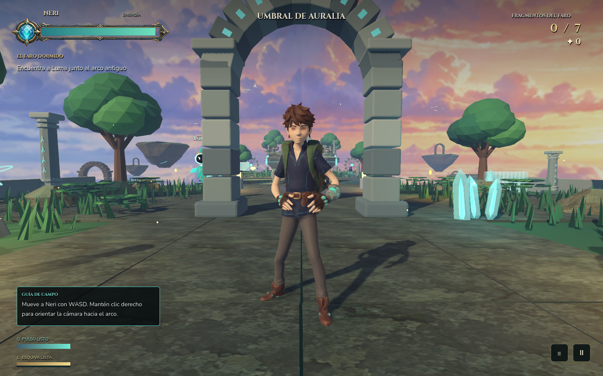

# Fragmentos de Luz

Aventura 3D de exploracion, puzles y combate ligero. Dos capitulos jugables en
cuatro islas: Auralia, Grutas Prismaticas, Picos del Cefiro y Observatorio Estelar.

**Demo 0.7.1, en estabilizacion.** Incluye a Neri con el modelo texturizado
proporcionado por el autor, 65 huesos y once animaciones. No es una campana terminada.

## Jugar o editar

1. Instala Godot; esta revision se ha probado con **Godot 4.7.2**, renderizador Forward+.
2. Importa `godot/project.godot` en Godot y ejecuta el proyecto.
3. En Windows puedes usar `Abrir_demo.cmd` o `Abrir_editor.cmd`. El lanzador busca
   `GODOT_EXE`, Godot en PATH y, finalmente, la instalacion local conocida.
   En otra maquina configura `GODOT_EXE` con la ruta del ejecutable.

La primera apertura importa los recursos. No hace falta Blender para jugar.
`Ver_prologo.cmd` reproduce el comic y regresa al menu sin borrar la partida.
No se incluye todavia un ejecutable independiente ni las plantillas de exportacion.

Controles: WASD, Espacio para saltar, Shift para correr, E para interactuar,
Q para el pulso, C para esquivar, J para el diario, K para las habilidades,
Esc para pausa. Camara con boton derecho y rueda. Tambien hay soporte de mando.

## Comprobar la demo

Desde la raiz del repositorio, con Python 3 y la ruta de Godot:

```powershell
python source_tools/validate_demo.py --godot "$env:GODOT_EXE"
python source_tools/validate_demo.py --godot "$env:GODOT_EXE" --visual
```

Las pruebas no leen ni escriben la partida del jugador. Cada ejecucion produce
informes nuevos en `artifacts/validation/`, fuera de Git. Comprueban guardados,
viajes, combate, las cuatro islas, habilidades, menus, prologo y el personaje.
`--visual` abre ventanas temporales y captura imagenes; `--repeat 3` repite los casos.
Estas pruebas aceleran la simulacion: **no son una medicion de rendimiento**.

## Modelo editable de Neri

- Fuente texturizada: `referencias-assets/09_modelo_neri/` (se conserva intacta).
- Esqueleto y animaciones de entrada: `source_assets/neri_meshy/neri_rigged_input.glb`.
- Editable actual: `blender/neri_demo.blend`, con texturas empaquetadas.
- Reconstruccion: `source_tools/build_neri_demo.py` con Blender 5.2.
- Metricas verificables: `blender/neri_demo_metrics.json`.

```powershell
& 'C:\Program Files\Blender Foundation\Blender 5.2\blender.exe' --background --python-exit-code 1 --python source_tools/build_neri_demo.py
```

El archivo del juego mantiene el nombre historico `neri_quaternius.glb` para no
romper referencias; su geometria actual es el modelo Meshy texturizado, no el
cuerpo Quaternius anterior. El constructor antiguo esta protegido contra una
ejecucion accidental.



## Estado y procedencia

Consultar [LEEME.md](LEEME.md) para el recorrido y los controles completos,
[DESARROLLO.md](DESARROLLO.md) para el historial y
[la estabilizacion de la demo](docs/DEMO_0_7_1.md) para cambios y limites.

Las animaciones proceden de Universal Animation Library de Quaternius, CC0; sus
licencias se conservan en `source_assets/quaternius/`. El modelo y sus texturas
Meshy fueron proporcionados por el autor del proyecto: hay que confirmar los
derechos de su plan de generacion antes de distribuirlos. La licencia de las
animaciones no concede por si sola una licencia al modelo ni al juego completo.
